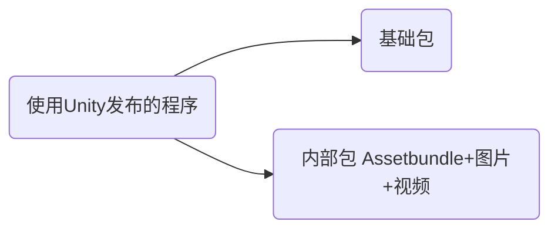

打包工具对比

## 用打包工具的目的

把多个文件或文件夹封装成可执行文件，安装后写入注册表（受控制面板管理），可以支持在控制面板卸载

## 打包工具介绍

| 打包工具                                   | 简介                            | 优点                                         | 缺点                                                         | 是否考虑使用 |
| ------------------------------------------ | ------------------------------- | -------------------------------------------- | ------------------------------------------------------------ | ------------ |
| Install Shield                             | VisualStudio2015可以集成的插件  | 集成到了Visual Studio开发工具，免费          | 不支持超过2G文件的打包，步骤复杂                             |              |
| Microsoft Visual Studio Installer Projects | 从Visual Studio里面扩展菜单安装 | 生成sln解决方案，设置简单                    |                                                              |              |
| setup factory                              | 图形化工具                      | 支持超过2G文件的打包                         | 步骤多，生成的脚本行数很多，不利于自动化，商用软件，存在版权问题 | 待定         |
| Inno setup                                 | 图形化工具+脚本编辑器           | 开源软件，可以自动化                         | 不支持超过2G文件的打包                                       |              |
| WinRar                                     | 压缩工具                        | 命令简单，可以自动化                         | 要自己写注册表和卸载程序                                     |              |
| NSIS                                       | 脚本编辑器，语法类似C++和VB     | 开源软件，有模板脚本，有帮助文档，可以自动化 | 不支持超过2G文件的打包，需要学习它的语法                     |              |

Unity的安装程序使用的是NSIS，每个安装包不超过2G

工具优先使用：NSIS > WinRar > Inno setup > Install Shield > setup factory

## 打包策略

基础包数据不会超过2G，内部包的数据可能超过2G; 

1. 只使用NSIS

当发布的程序不超过2G时，直接使用NSIS打包即可

当发布的程序超过2G时，使用NSIS打包基础包，内部包则拆开来打包

2. NSIS+WinRar

   当发布的程序不超过2G时，直接使用NSIS打包即可

   当发布的程序超过2G时，使用NSIS打包基础包，内部包则拆开来用WinRar打包

